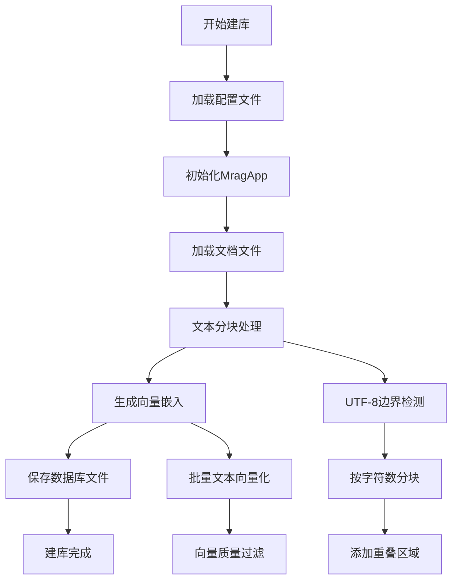
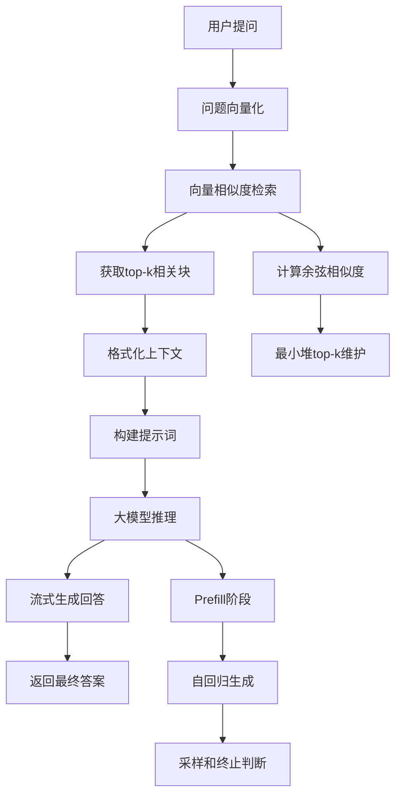

# MRAG 系统设计文档

## 🏗️ 系统架构

### 总体架构图

```
┌─────────────────────────────────────────────────────────────┐
│                    用户交互层                                 │
├─────────────────────────────────────────────────────────────┤
│ 命令行界面 (main.cc)                                         │
│  ├── 离线建库模式 (--ingest)                                 │
│  └── 在线问答模式 (--chat)                                   │
└───────────────────────────────┬─────────────────────────────┘
                                │
┌───────────────────────────────▼─────────────────────────────┐
│                    应用协调层                                 │
├─────────────────────────────────────────────────────────────┤
│ MragApp 类 (mragapp.h/cc)                                    │
│  ├── 配置管理 (AppConfig)                                    │
│  ├── 文档处理 (Document Processing)                          │
│  ├── 嵌入生成 (Embedding Engine)                             │
│  ├── 向量检索 (Vector Database)                              │
│  └── 回答生成 (Generation Engine)                            │
└───────────────────────┬───────┬─────────────────────────────┘
                        │       │
        ┌───────────────▼───────▼─────────────────────────────┐
        │                核心引擎层                             │
        ├─────────────────────────────────────────────────────┤
        │ 文档处理器 (document.h/cc)                           │
        │  ├── StreamingUTF8Splitter                           │
        │  └── ChunkOverlapProcessor                           │
        │                                                     │
        │ 嵌入引擎 (embeddingengine.h/cc)                      │
        │  ├── LlamaModelBase (基类)                           │
        │  └── 向量生成逻辑                                     │
        │                                                     │
        │ 生成引擎 (generationengine.h/cc)                     │
        │  ├── LlamaModelBase (基类)                           │
        │  └── ChatML 格式对话生成                              │
        │                                                     │
        │ 向量数据库 (vectordatabase.h/cc)                     │
        │  ├── ScoredChunk 结构                                │
        │  └── 余弦相似度检索                                   │
        └───────────────┬───────┬─────────────────────────────┘
                        │       │
        ┌───────────────▼───────▼─────────────────────────────┐
        │                底层支持层                             │
        ├─────────────────────────────────────────────────────┤
        │ llama.cpp 集成 (llamamodel.h/cc)                     │
        │  ├── 模型加载与管理                                   │
        │  ├── 上下文创建                                       │
        │  └── Tokenization                                    │
        │                                                     │
        │ 配置系统 (config.h/cc)                               │
        │  ├── AppConfig 结构体                                │
        │  └── JSON 配置加载                                    │
        │                                                     │
        │ 数据模型 (chunk.h/cc)                                │
        │  ├── chunk 结构体                                    │
        │  ├── 序列化/反序列化                                  │
        │  └── UTF8 处理工具                                   │
        └─────────────────────────────────────────────────────┘
```

### 数据流程图

```
离线建库流程：
小说文本 → 文档分块 → 文本块 → 向量嵌入 → 向量数据库

在线问答流程：
用户问题 → 问题向量化 → 向量检索 → 相关文本块 → 生成回答 → 返回答案
```

## 🧩 核心组件说明

### 1. MragApp 类 (`mragapp.h/cc`)

**职责**：协调所有组件，提供高层API

**主要方法**：
- `loadDocument()` - 加载并处理文档
- `saveChunks()` - 保存块数据到文件
- `loadChunks()` - 从文件加载块数据
- `query()` - 执行问答查询

**内部协调流程**：
```cpp
// 查询流程
1. generateQueryEmbedding()   // 生成问题向量
2. retrieveRelevantChunks()   // 检索相关块
3. generation_engine_->generateStream()  // 生成回答
```

### 2. 配置系统 (`config.h/cc`)

**职责**：管理运行时配置

**配置项**：
```cpp
struct AppConfig {
    // 模型路径
    std::string emb_model_path;
    std::string gen_model_path;
    
    // 文档处理
    size_t chunk_size = 500;      // 块大小（字符）
    size_t overlap_size = 50;     // 重叠大小
    
    // 检索参数
    int top_k = 3;               // 检索top-k
    
    // 生成参数
    int max_output_tokens = 512; // 最大输出token数
    float temperature = 0.7f;    // 温度参数
    
    // 嵌入参数
    int emb_n_ctx = 512;         // 嵌入上下文大小
    
    static AppConfig load(const std::string& config_path);
};
```

### 3. 文档处理系统 (`document.h/cc`)

**职责**：文本分块和预处理

**核心组件**：
- `StreamingUTF8Splitter` - 流式UTF-8文本分割器
  - 支持大文件流式处理
  - 正确处理UTF-8字符边界
  - 自动检测章节标题（正则：`第.{1,12}回`）

- `ChunkOverlapProcessor` - 块重叠处理器
  - 添加块间重叠，避免信息割裂
  - 使用前一个块的尾部作为下一个块的开头

**全局变量**：
```cpp
extern std::vector<chunk> chunks;  // 存储处理后的文本块
```

### 4. 数据模型 (`chunk.h/cc`)

**职责**：定义核心数据结构

**chunk 结构体**：
```cpp
struct chunk {
    uint64_t id;                   // 唯一标识
    std::string text;              // 文本内容
    std::string metadata;          // 元数据（章节信息）
    std::vector<float> embedding;  // 向量嵌入
    
    // 序列化/反序列化
    void serialize(std::ofstream& out) const;
    static chunk deserialize(std::ifstream& in);
};
```

**辅助工具**：
- `UTF8Helper` - UTF-8字符边界检测
- `ChunkOverlapProcessor` - 块重叠处理

### 5. 模型基类 (`llamamodel.h/cc`)

**职责**：封装 llama.cpp 基础功能

**设计模式**：
- **模式枚举**：`ModelMode::Embedding` / `ModelMode::Generation`
- **工厂模式**：根据模式加载不同模型
- **RAII**：自动资源管理

**关键方法**：
```cpp
class LlamaModelBase {
    // 模型加载和上下文创建
    void loadModel(const AppConfig& config);
    void createContext(const AppConfig& config);
    
    // Tokenization
    std::vector<llama_token> tokenize(const std::string& text, bool add_bos = true) const;
    
    // 资源访问
    llama_context* getContext() const;
    llama_model* getModel() const;
    const llama_vocab* getVocab() const;
};
```

### 6. 嵌入引擎 (`embeddingengine.h/cc`)

**职责**：文本向量化

**继承关系**：`EmbeddingEngine : public LlamaModelBase`

**核心流程**：
```
1. 文本清理（sanitizeUtf8）
2. Tokenization（考虑上下文长度限制）
3. 清空KV缓存
4. Batch推理
5. 提取嵌入向量
```

**特点**：
- 支持长文本截断（`emb_n_ctx` 限制）
- UTF-8完整性检查
- 错误处理和降级

### 7. 生成引擎 (`generationengine.h/cc`)

**职责**：基于检索内容生成回答

**继承关系**：`GenerationEngine : public LlamaModelBase`

**提示词模板**（ChatML格式）：
```text
<|im_start|>system
你是一个严谨的小说阅读助手。请你【必须并且只能】根据下面提供的[参考上下文]来回答用户的问题。
如果上下文中有答案，请详细回答并引用出处；如果上下文中没有提到相关信息，请直接回答"根据当前片段无法确定答案"。
<|im_end|>
<|im_start|>user
[参考上下文]：
[1] 第XX回: 文本内容...
[2] 第YY回: 文本内容...

用户问题：{query}
<|im_end|>
<|im_start|>assistant
```

**生成流程**：
```
1. 格式化上下文（添加出处标注）
2. 构建提示词
3. Prefill（提示词推理）
4. 自回归生成（带采样）
5. 流式输出
```

### 8. 向量数据库 (`vectordatabase.h/cc`)

**职责**：向量相似度检索

**检索算法**：
- **数据结构**：`ScoredChunk`（相似度+块指针）
- **检索策略**：top-k 余弦相似度
- **优化**：最小堆维护top-k结果

**核心函数**：
```cpp
std::vector<const chunk*> search(
    const std::vector<float>& query_emb,
    const std::vector<chunk>& database,
    int top_k
);
```

**相似度计算**：
```cpp
相似度 = dot(query, chunk) / (|query| * |chunk|)
```

### 9. 命令行界面 (`main.cc`)

**职责**：用户交互和模式分发

**运行模式**：
1. **离线建库模式** (`--ingest`)
   ```
   加载配置 → 初始化 → 处理文档 → 保存数据库
   ```

2. **在线问答模式** (`--chat`)
   ```
   加载配置 → 初始化 → 加载数据库 → 交互问答
   ```

**日志控制**：
```cpp
// 屏蔽底层日志，只显示自定义进度
llama_log_set(empty_log_callback, nullptr);
```

## 🔄 工作流程详解

### 离线建库工作流



### 在线问答工作流



## ⚠️ 已知局限性

### 1. 性能限制

**内存消耗**：
- 7B模型需要 ~8GB RAM
- 向量数据库随文档大小线性增长
- 建议：大型文档（>10MB）需要16GB+内存

**处理速度**：
- 嵌入生成：~100-200块/分钟（CPU）
- 回答生成：~10-30秒/问题（7B模型）
- 建议：使用GPU加速，选择量化模型

### 2. 功能限制

**文档格式**：
- 仅支持纯文本TXT格式
- UTF-8编码要求严格
- 不支持PDF、Word等格式

**检索精度**：
- 基于余弦相似度的语义检索
- 可能错过语义相关但词汇不同的内容
- 建议：增大`top_k`参数，优化分块策略

**回答质量**：
- 严格依赖检索到的内容
- 超出检索内容的问题无法回答
- 建议：确保文档质量，优化分块大小

### 3. 技术限制

**模型兼容性**：
- 仅支持GGUF格式的llama.cpp模型
- 需要与llama.cpp版本兼容
- 建议：使用官方推荐的模型版本

**系统依赖**：
- 需要llama.cpp预编译库
- Windows需要Visual C++运行时
- GPU加速需要CUDA工具链

**配置复杂度**：
- 配置文件需要手动编辑
- 模型路径需要绝对路径
- 参数调优需要实验

### 4. 使用限制

**操作模式**：
- 建库和问答分离，不能实时更新
- 数据库更新需要重新建库
- 建议：定期更新数据库版本

**资源需求**：
- 同时需要嵌入和生成两个模型
- 磁盘空间：两个模型约5-10GB
- 建议：使用量化版本减少空间占用

## 🚧 改进建议

### 短期改进
1. **批量处理优化**：并行化嵌入生成
2. **缓存机制**：缓存常用查询的嵌入向量
3. **配置简化**：支持相对路径和默认配置
4. **错误恢复**：更完善的异常处理和重试机制

### 中期改进
1. **格式扩展**：支持PDF、EPUB等格式
2. **检索优化**：引入混合检索（关键词+向量）
3. **模型切换**：运行时模型热切换
4. **API服务**：提供HTTP API接口

### 长期改进
1. **多模态支持**：图像、音频内容处理
2. **增量更新**：支持数据库增量更新
3. **分布式检索**：支持大规模文档检索
4. **智能分块**：基于语义的智能分块

## 📊 性能基准

### 测试环境
- CPU: Intel i7-12700H
- RAM:813) 32GB
- GPU: NVIDIA RTX 3060 (6GB)
- 模型: Qwen2.5-7B-Instruct (q4_k_m)

### 性能数据
| 任务 | 时间 | 内存使用 | 备注 |
|------|------|----------|------|
| 文档处理（1MB） | 2-3秒 | 500MB | 分块和预处理 |
| 嵌入生成（1000块） | 5-8分钟 | 2GB | CPU模式 |
| 数据库保存 | 1-2秒 | 100MB | 二进制序列化 |
| 问题检索 | 0.1-0.3秒 | 50MB | 1000块数据库 |
| 回答生成 | generally 1-20秒 | 4GB | 512token输出 |

## 🔍 调试建议

### 日志级别
```cpp
// 当前：完全屏蔽底层日志
llama_log_set(empty_log_callback, nullptr);

// 调试时可启用部分日志
static void debug_log_callback(enum ggml_log_level level, const char * text, void * user_data) {
    if (level >= GGML_LOG_LEVEL_WARN) {  // 只显示警告和错误
        fprintf(stderr, "%s", text);
    }
}
```

### 性能分析
1. **时间测量**：各阶段耗时统计
2. **内存监控**：峰值内存使用
3. **检索质量**：top-k命中率分析
4. **回答相关性**：人工评估回答质量

### 配置调优
1. **分块大小**：`chunk_size` 平衡检索精度和速度
2. **重叠大小**：`overlap_size` 避免信息割裂
3. **检索数量**：`top_k` 平衡召回率和噪声
4. **生成参数**：`temperature` 控制创造性